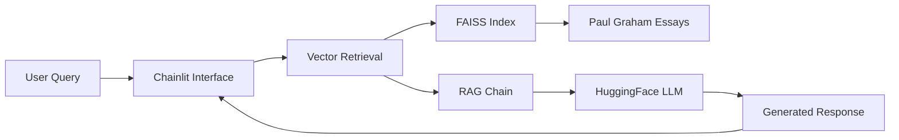

# 🧠 Paul Graham Essay Bot

> *Chat with the wisdom of Paul Graham's essays through AI-powered retrieval and generation*

[](https://python.org)
[](https://chainlit.io)
[](https://huggingface.co)
[](LICENSE)

## 🎯 What is this?

The **Paul Graham Essay Bot** is an intelligent conversational AI that lets you explore and discuss Paul Graham's influential essays through natural language. Using cutting-edge Retrieval-Augmented Generation (RAG), the bot retrieves relevant passages from Paul Graham's extensive collection of essays and generates thoughtful, contextual responses to your questions.

### ✨ Key Features

- 🔍 **Smart Retrieval**: FAISS-powered vector search through Paul Graham's essay collection
- 🤖 **AI-Powered Responses**: HuggingFace endpoint integration for natural language generation
- 💬 **Interactive Chat**: Beautiful Chainlit-powered web interface
- 📚 **Comprehensive Knowledge**: Access to Paul Graham's complete essay archive
- ⚡ **Real-time Streaming**: Watch responses generate in real-time
- 🔒 **Context-Aware**: Only answers based on actual essay content

## 🚀 Quick Start

### Prerequisites

- Python 3.9 or higher
- HuggingFace account with API access
- Environment variables for HuggingFace endpoints

### 🛠️ Installation

1. **Clone the repository**
   ```bash
   git clone <your-repo-url>
   cd AIE6-Production-Demo
   ```

2. **Install dependencies**
   ```bash
   # Using uv (recommended)
   uv sync

   # Or using pip
   pip install -r requirements.txt
   ```

3. **Set up environment variables**
   ```bash
   cp .env.example .env
   # Edit .env with your HuggingFace credentials
   ```

   Your `.env` file should contain:
   ```env
   HF_TOKEN=your_huggingface_token_here
   HF_LLM_ENDPOINT=your_llm_endpoint_url
   HF_EMBED_ENDPOINT=your_embedding_endpoint_url
   ```

4. **Run the application**
   ```bash
   chainlit run app.py
   ```

5. **Open your browser** to `http://localhost:8000` and start chatting! 🎉

## 🏗️ Architecture



### 🔧 Technical Stack

- **Frontend**: [Chainlit](https://chainlit.io) - Modern chat interface
- **Embeddings**: HuggingFace Endpoint Embeddings
- **Vector Store**: [FAISS](https://faiss.ai) - Facebook's similarity search
- **LLM**: HuggingFace Endpoint (configurable model)
- **Framework**: [LangChain](https://langchain.com) - LLM application framework
- **Text Processing**: RecursiveCharacterTextSplitter for document chunking

## 📖 Usage Examples

### Example Conversations

**🎯 Startup Advice**
```
You: "What does Paul Graham say about starting a startup?"
Bot: "Based on Paul Graham's essays, he emphasizes that the most important thing about starting a startup is to solve a problem you yourself have..."
```

**💡 Programming Philosophy**
```
You: "What are Paul Graham's thoughts on programming languages?"
Bot: "Paul Graham has written extensively about programming languages. In his essay 'Beating the Averages,' he discusses how Lisp gave his startup a competitive advantage..."
```

**🎓 Education and Learning**
```
You: "How does Paul Graham view traditional education?"
Bot: "Paul Graham is quite critical of traditional education in several essays. He argues that schools are primarily designed for crowd control rather than learning..."
```

## 🐳 Docker Deployment

The application includes a Dockerfile for easy deployment:

```bash
# Build the image
docker build -t paul-graham-bot .

# Run the container
docker run -p 8000:8000 --env-file .env paul-graham-bot
```

## 📁 Project Structure

```
AIE6-Production-Demo/
├── app.py              # Main application file
├── data/
│   └── paul_graham_essays.txt  # Essay collection (2.9MB)
├── pyproject.toml      # Project dependencies
├── Dockerfile          # Container configuration
├── chainlit.md         # Chainlit welcome message
├── .env.example        # Environment template
└── README.md           # This file
```

## 🤝 Contributing

We welcome contributions! Here's how you can help:

1. 🍴 Fork the repository
2. 🌿 Create a feature branch (`git checkout -b feature/amazing-feature`)
3. 💍 Commit your changes (`git commit -m 'Add amazing feature'`)
4. 📤 Push to the branch (`git push origin feature/amazing-feature`)
5. 🔥 Open a Pull Request

### 🐛 Found a Bug?

Please open an issue with:
- Description of the problem
- Steps to reproduce
- Expected vs actual behavior
- Your environment details

## 📜 License

This project is licensed under the MIT License - see the [LICENSE](LICENSE) file for details.

## 🙏 Acknowledgment

- [**AI Makerspace**](https://aimakerspace.io/) for an awesome bootcamp.


---

*Built with ❤️ for the startup and tech community*
README.md generated by Claude 4 Sonnet via Cursor 0.50.5
